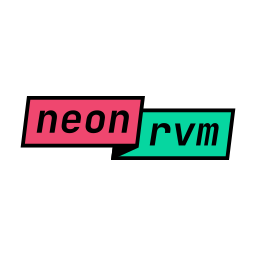

# Introduction

**neonrvm** is an open source machine learning library for performing regression
tasks using [RVM] technique. It is written in C programming language and comes
with bindings for the Python programming language.

neonrvm was born during my master's thesis to help reduce training times and
required system resources. neonrvm did that by getting rid of multiple
middleware layers and optimizing memory usage.

Under the hood neonrvm uses expectation maximization fitting method, and allows
basis functions to be fed incrementally to the model. This helps to keep
training times and memory requirements significantly lower for large data sets.

neonrvm is not trying to be a full featured machine learning framework, and only
provides core training and prediction facilities. You might want to use it in
conjunction with higher level scientific programming languages and machine
learning tool kits instead.

RVM technique is very sensitive to input data representation and kernel
selection. You might consider something else if you are looking for a less
challenging solution.

[RVM]: https://en.wikipedia.org/wiki/Relevance_vector_machine
